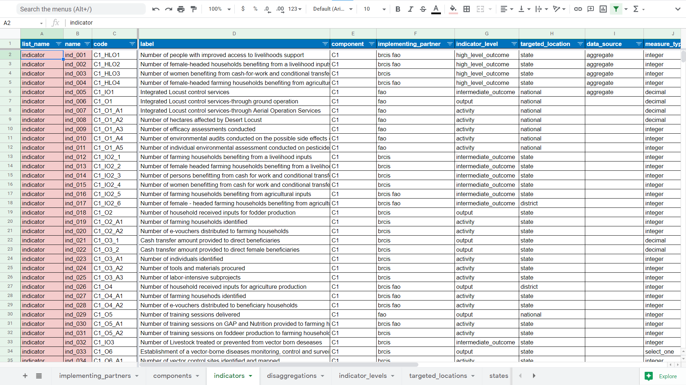

===========================
Maintenance & Customization
===========================

Some elements of the SCRP MIS can be customized whenever there are changes in the project.
This mainly applies to modules that collect data regarding:

- Implementing Partners
- Components
- Indicators
- Disaggregations
- States
- Districts

Customize SCRP MIS Settings
---------------------------

Open the online version of the `scrp_mis_settings <https://docs.google.com/spreadsheets/d/1WvWbcByXX-8_oNc3Je2ET5kgjF6_6tXJ4KuOZlhm92o/>`_
to get started. Note that only the MIS administrator can currently access the file.

How To Update Implementing Partners
^^^^^^^^^^^^^^^^^^^^^^^^^^^^^^^^^^^

In case there are any changes/updates to the list of implementing partners,
follow the steps below to change the values on the MIS.

#. Access the `scrp_mis_settings <https://docs.google.com/spreadsheets/d/1WvWbcByXX-8_oNc3Je2ET5kgjF6_6tXJ4KuOZlhm92o/>`_ 
   and navigate to the **implementing_partners** sheet to see the full list of implementing partners in the MIS.

   .. image:: _static/settings_ips.png
        :width: 800
        :alt: IP Settings

#. Edit values in any of the cells within the green box in the image above.

   **NB:** Be sure to indicate the components an IP can report on in the **components** column.
   Separate multiple components with a single space.

#. To add new implementing partners, drag the last row to make copies of it.
#. Edit the values in the newly created rows.

How To Update Components
^^^^^^^^^^^^^^^^^^^^^^^^

In case there are any changes/updates to the list of components,
follow the steps below to change the values on the MIS.

#. Access the `scrp_mis_settings <https://docs.google.com/spreadsheets/d/1WvWbcByXX-8_oNc3Je2ET5kgjF6_6tXJ4KuOZlhm92o/>`_ 
   and navigate to the **components** sheet to see the full list of components in the MIS.

   .. image:: _static/settings_components.png
        :width: 800
        :alt: Component Settings

#. Edit values in any of the cells within the green box in the image above.
#. To add new components, drag the last row to make copies of it.
#. Edit the values in the newly created rows.

How To Update Indicators
^^^^^^^^^^^^^^^^^^^^^^^^

In case there are any changes/updates to the indicators,
follow the steps below to change the values on the MIS.

#. Access the `scrp_mis_settings <https://docs.google.com/spreadsheets/d/1WvWbcByXX-8_oNc3Je2ET5kgjF6_6tXJ4KuOZlhm92o/>`_ 
   and navigate to the **indicators** sheet to see the full list of indicators in the MIS.

   .. image:: _static/settings.png
        :width: 800
        :alt: Indicator Settings

#. Edit values in any of the cells within the columns below:
        
    * code
    * label
    * component
    * implementing_partner
    * indicator_level
    * targeted_location
    * data_source
    * measure_type
    * disaggregation
    * budget
    * minimum_target
    * maximum_target

   **NB:** Ensure the values entered in the columns are valid.
   Refer to the **component, implenting_partner, disaggregation** sheet for valid values.

#. To add new indicators, drag the last row to make copies of it.
#. Edit the values in the newly created rows.

How To Update Disaggregations
^^^^^^^^^^^^^^^^^^^^^^^^^^^^^

In case there are any changes/updates to the list of disaggregations,
follow the steps below to change the values on the MIS.

#. Access the `scrp_mis_settings <https://docs.google.com/spreadsheets/d/1WvWbcByXX-8_oNc3Je2ET5kgjF6_6tXJ4KuOZlhm92o/>`_ 
   and navigate to the **disaggregations** sheet to see the full list of components in the MIS.

   .. image:: _static/settings_disaggregations.png
        :width: 800
        :alt: Disaggregation Settings

#. Edit values in any of the cells within the green box in the image above.
#. To add new components, drag the last row to make copies of it.
#. Edit the values in the newly created rows.

How To Update Districts
^^^^^^^^^^^^^^^^^^^^^^^

In case there are any changes/updates to the list of relevant districts in the project,
follow the steps below to change the values on the MIS.

#. Access the `scrp_mis_settings <https://docs.google.com/spreadsheets/d/1WvWbcByXX-8_oNc3Je2ET5kgjF6_6tXJ4KuOZlhm92o/>`_ 
   and navigate to the **districts** sheet to see the full list of districts in the MIS.

   .. image:: _static/settings_districts.png
        :width: 800
        :alt: District Settings

#. Edit values in any of the cells within the green box in the image above.

   **NB:** Be sure to use the appropriate state name in the state column.
   Refer to the **states** sheet for state names.

#. To add new components, drag the last row to make copies of it.
#. Edit the values in the newly created rows.

Update Settings in KoBoToolbox
------------------------------

Follow these steps below to update changed settings in KoBoToolbox.

#. Save your settings as a .csv file

   .. image:: _static/save_csv.png
        :width: 800
        :alt: Save CSV

#. Rename your downloaded file to match the name of the sheet. In this case, the new name will be **indicators.csv**
#. Login to KoBoToolbox using the MIS administrator account and open the specific form you wish to update.
#. Navigate to the settings page of the form and click on Media.

   .. image:: _static/kobo_form_settings.png
        :width: 800
        :alt: KoBoToolbox Form Settings

#. Delete the existing file from the Attached Files list and upload the new one you renamed in Step 2.
#. Navigate to the form tab and Redeploy the form for changes to take effect.

   .. image:: _static/kobo_form_redeploy.png
        :width: 800
        :alt: KoBoToolbox Form Redeploy

Update Settings in Power BI
--------------------------------

Any changes to the settings will be automatically updated whenever Power BI Service refreshes
data. However, you can trigger a manual refresh using these steps:

#. Login to the Microsoft Power BI hosting the SCRP_MIS
   and click on the “Datasets” icon to view all datasets.
#. Navigate to the “My Datasets” tab and hover the mouse over SCRP_MIS dataset. 
#. Click on the Refresh now button to initiate the data refresh process.
#. Once data refresh is complete, navigate back to the dashboard to verify changes.