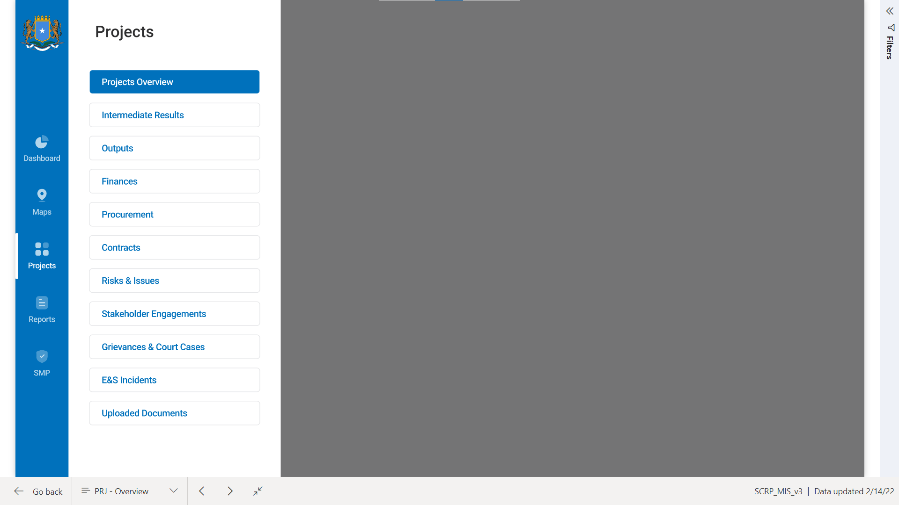

============
MIS Modules
============

There are currently 10 modules in the MIS which track and report on various things as
outlined in the :ref:`doc_overview:Data Collection Platform` section. The modules include:

.. toctree::
   :maxdepth: 1

   doc_performance_indicators
   doc_risks_issues
   doc_es_safeguards
   doc_procurement
   doc_contracts
   doc_financials
   doc_activity_workplans
   doc_assets
   doc_fiduciary_compliance
   doc_smp