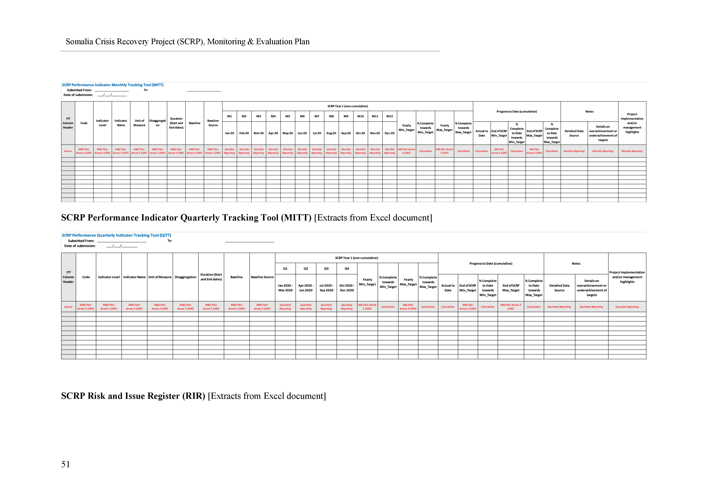
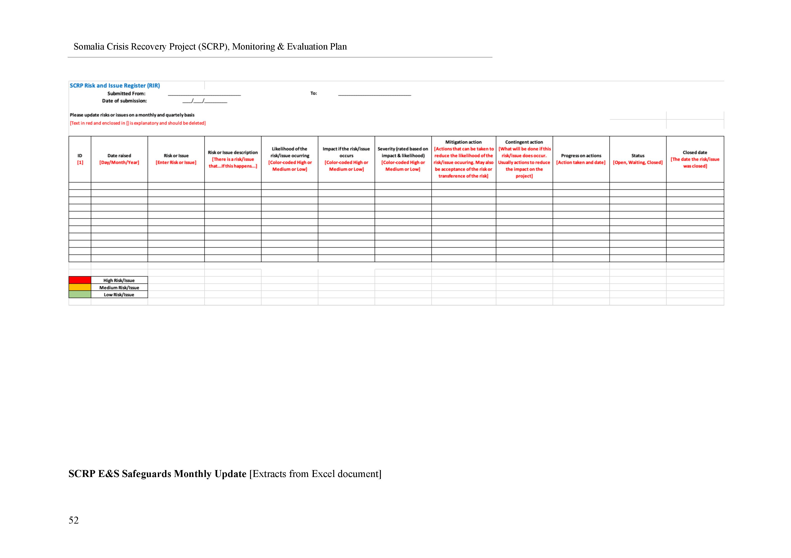
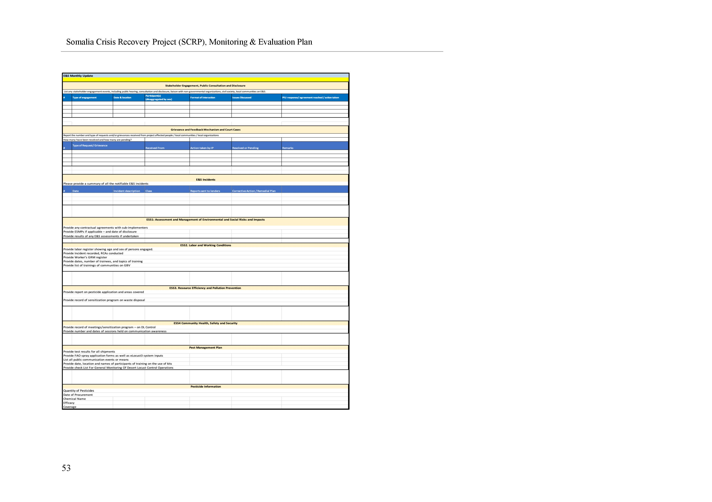
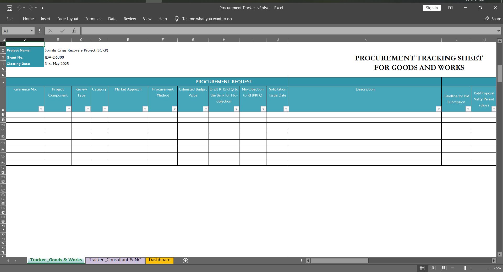
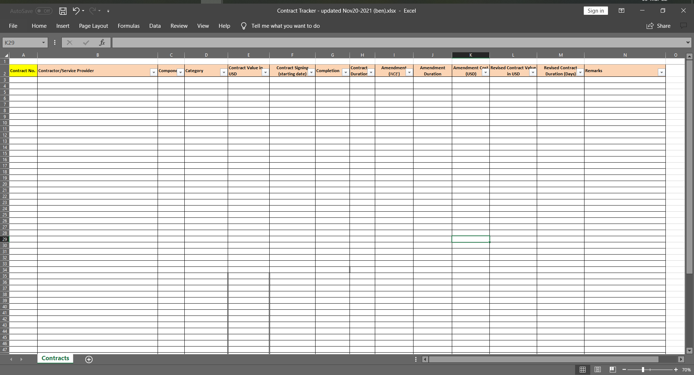
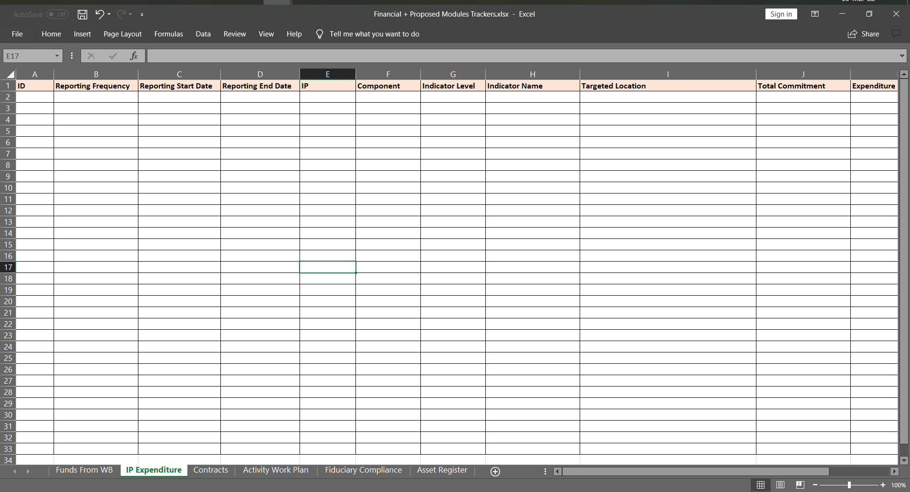
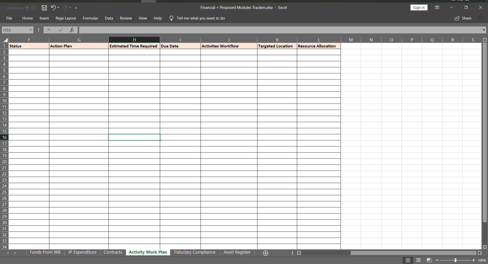
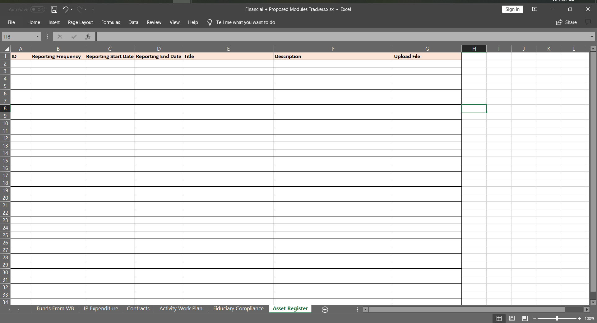
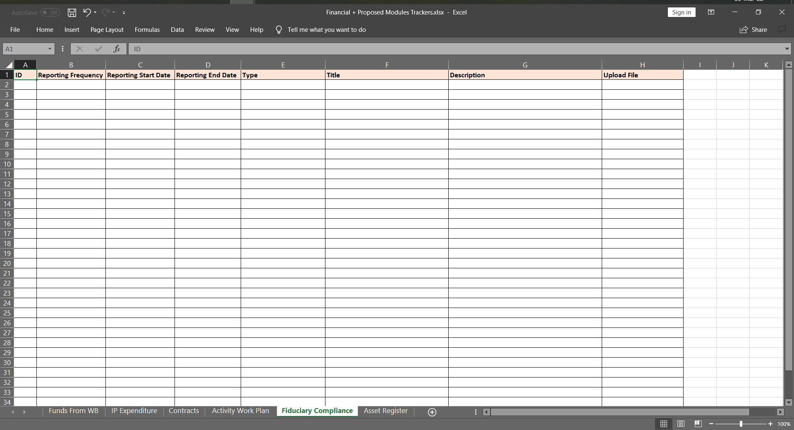
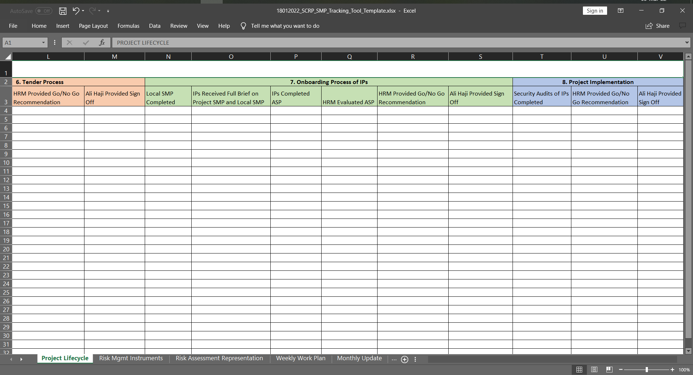

==============
Tracking Tools
==============

Find below detailed information about the tracking tools which collect
data in the SCRP MIS.

Performance Indicator
---------------------

Source: SCRP M&E Plan 28/02/2021
Source: SCRP Updated ORF 17/05/2021

Risk & Issue
------------

Source: SCRP M&E Plan 28/02/2021

E&S Safeguards
--------------

Source: SCRP M&E Plan 28/02/2021

Procurement
-----------

Source: Procurement Tracker v2

Contract
--------

Source: Contract Tracker - Nov 2021

Financial
---------

Source: PIU Quarterly Report

Activity Work Plan
------------------

Source: ZIRP MIS Activity Work Plan

Asset Report
------------

Source: PIU

Fiduciary Compliance
--------------------

Source: PIU

SMP
---

Source: HRM SMP Concept Note