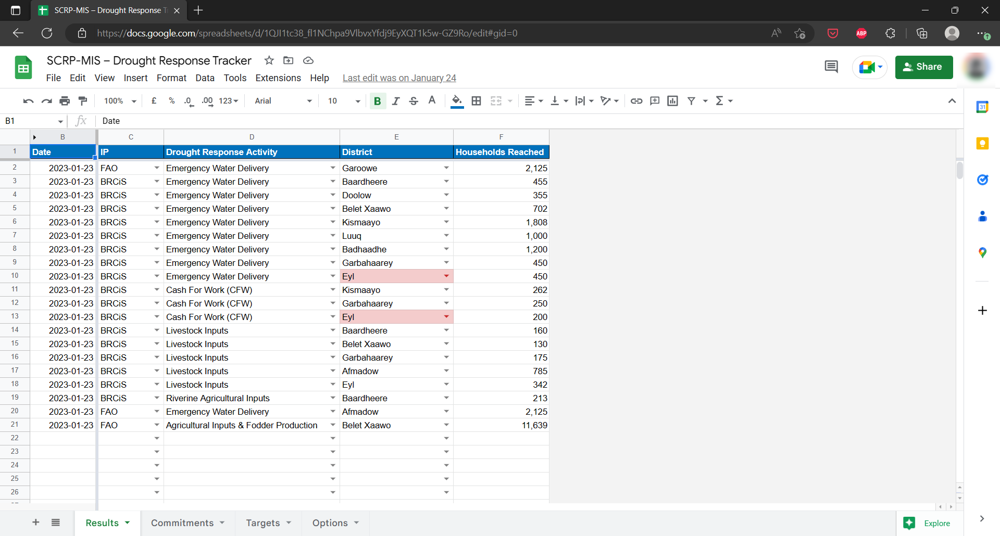
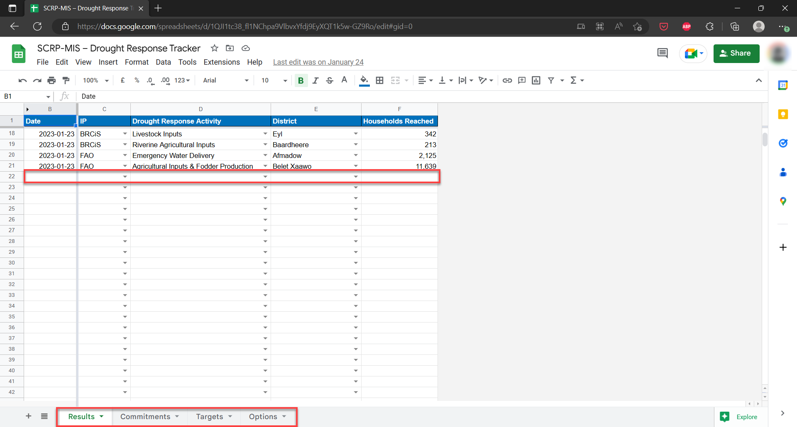
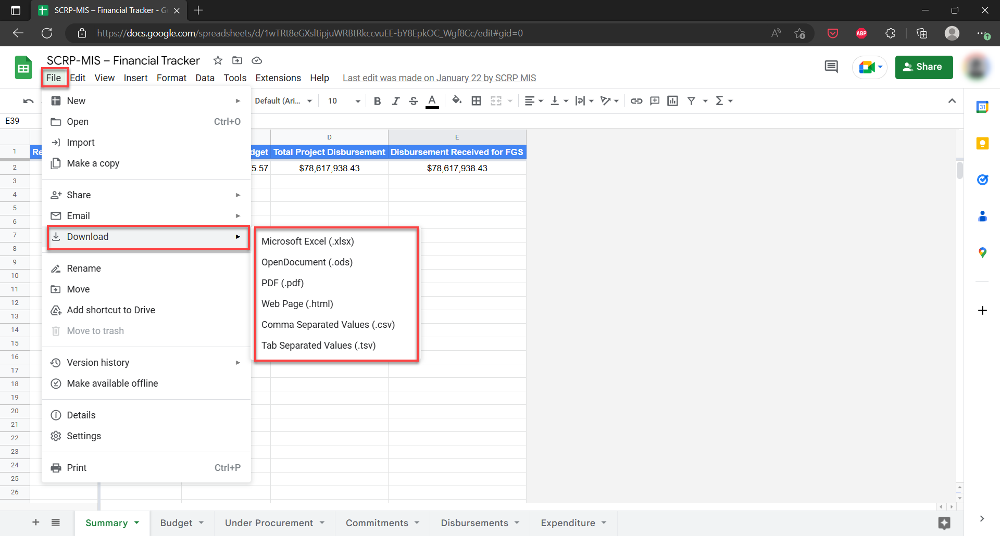

========================
Drought Response Tracker
========================

The Drought Response Tracker is a Google Sheets document 
that monitors drought-related activities data within the SCRP.

This guide shows how the PIU can:

- Access the tracker
- Add, Edit, and Delete records
- Export the drought response data

Accessing The Drought Response Tracker
------------------------------------------

Use the link below to access the Drought Response Tracker:

- `https://docs.google.com/spreadsheets/d/1QJI1tc38_fl1NChpa9VlbvxYfdj9EyXQT1k5w-GZ9Ro/ <https://docs.google.com/spreadsheets/d/1QJI1tc38_fl1NChpa9VlbvxYfdj9EyXQT1k5w-GZ9Ro/>`_

Please note that **you need access rights from the PIU MIS Administrator** to view the tracker.

Adding, Editing, and Deleting Records
-------------------------------------

The Drought Response Tracker has 3 work sheets that track different aspects:

- Results
- Commitments 
- Targets
- Options - settings for fields within the spreadsheet

To get started on data entry/editing or deleting of records, do the following:

#. Select either of the three main worksheets and enter data on the first empty row after the column headers
#. Edit data by selecting the specific cell you wish to Update
#. To delete data, you can either select a single cell or the entire row and hit the delete button

Exporting Drought Response Data
-----------------------------------

#. Access the Drought Response Tracker
#. Select "File" > "Download" from the navigation menu on Google Sheets
#. Choose the data format you want to begin download