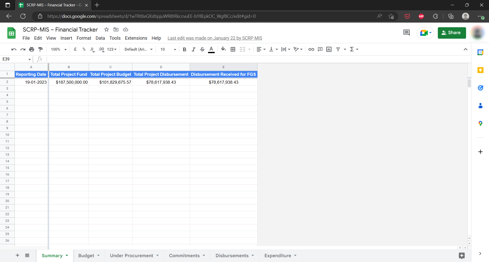
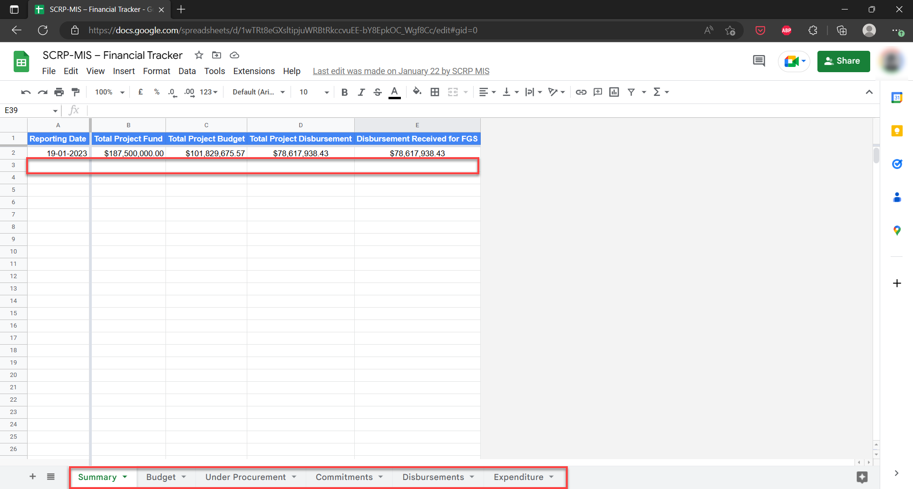

=================
Financial Tracker
=================

The Financial Tracker is a Google Sheets document containing the financial summary, budget, amounts under procurement,
amounts under commitment, disbursed amounts, and expenditure within the SCRP.

This guide shows how the PIU can:

- Access the tracker
- Add, Edit, and Delete records
- Export the financial data

Accessing The Financial Tracker
-------------------------------

Use the link below to access the Financial Tracker:

- `https://docs.google.com/spreadsheets/d/1wTRt8eGXsltipjuWRBtRkccvuEE-bY8EpkOC_Wgf8Cc/ <https://docs.google.com/spreadsheets/d/1wTRt8eGXsltipjuWRBtRkccvuEE-bY8EpkOC_Wgf8Cc/>`_

Please note that **you need access rights from the PIU MIS Administrator** to view the tracker.

Adding, Editing, and Deleting Records
-------------------------------------

The Financial Tracker has 6 work sheets that track different aspects:

- Summary
- Budget
- Under Procurement 
- Commitments 
- Disbursements 
- Expenditures 

To get started on data entry/editing or deleting of records, do the following:

#. Select the summary sheet and enter data on the first empty row after the column headers
#. Edit data by selecting the specific cell you wish to Update
#. Click on any of the other worksheets and enter/edit component data
#. To delete data, you can either select a single cell or the entire row and hit the delete button

Exporting Financial Data
------------------------

.. image:: _static/gs_export.png
  :width: 800
  :alt: Accessing SCRP Change Log

#. Access the Financial Tracker
#. Select "File" > "Download" from the navigation menu on Google Sheets
#. Choose the data format you want to begin download