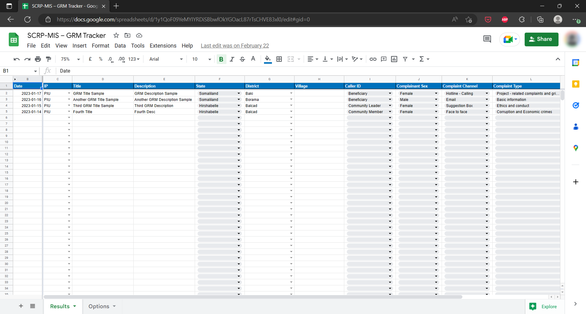
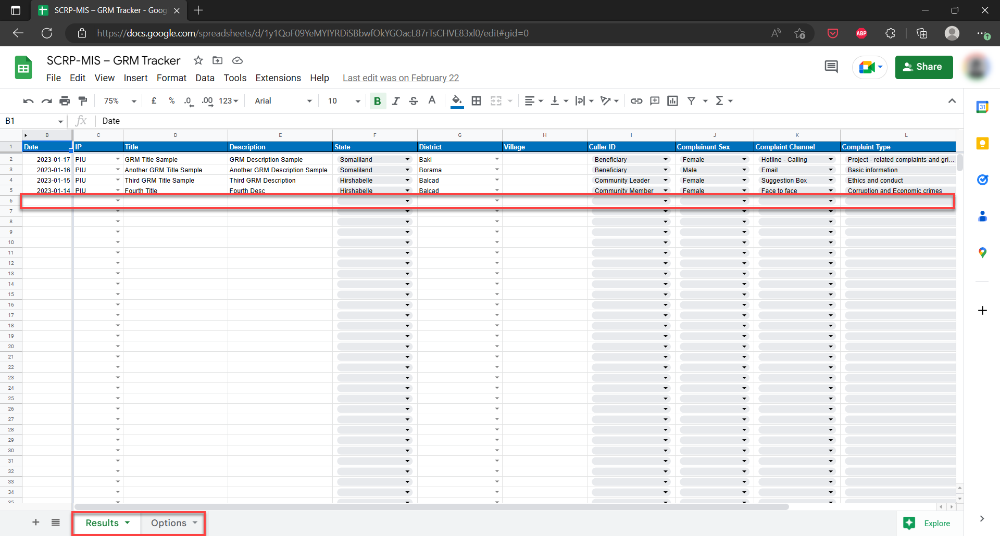

===========
GRM Tracker
===========

The GRM Tracker is a Google Sheets document 
that monitors GRM-related activities data within the SCRP.

This guide shows how the PIU can:

- Access the tracker
- Add, Edit, and Delete records
- Export the GRM data

Accessing The GRM Tracker
-------------------------

Use the link below to access the GRM Tracker:

- `https://docs.google.com/spreadsheets/d/1y1QoF09YeMYIYRDiSBbwfOkYGOacL87rTsCHVE83xl0/ <https://docs.google.com/spreadsheets/d/1y1QoF09YeMYIYRDiSBbwfOkYGOacL87rTsCHVE83xl0/>`_

Please note that **you need access rights from the PIU MIS Administrator** to view the tracker.

Adding, Editing, and Deleting Records
-------------------------------------

The GRM Tracker has 2 main work sheets:

- Results
- Options - settings for fields within the spreadsheet

To get started on data entry/editing or deleting of records, do the following:

#. Select the main worksheet (results) and enter data on the first empty row after the column headers
#. Edit data by selecting the specific cell you wish to Update
#. To delete data, you can either select a single cell or the entire row and hit the delete button

Exporting GRM Data
------------------

.. image:: _static/gs_export.png
  :width: 800
  :alt: Accessing SCRP GRM Data

#. Access the GRM Tracker
#. Select "File" > "Download" from the navigation menu on Google Sheets
#. Choose the data format you want to begin download