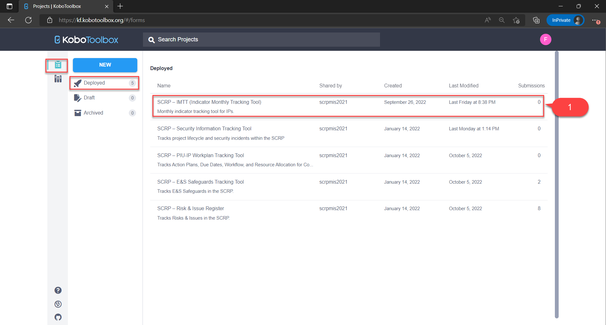
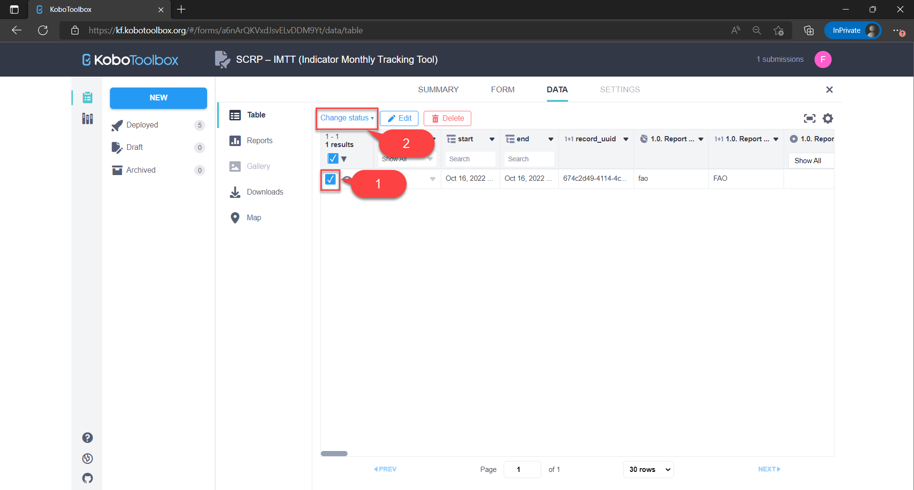
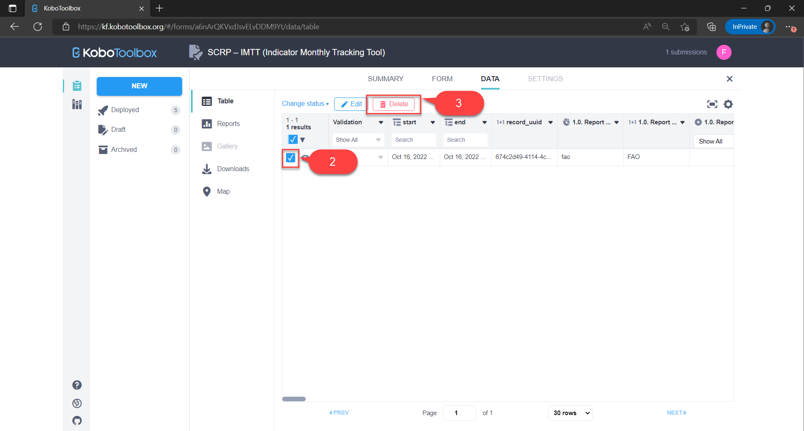

=============================
Indicator Tracking Tool (ITT)
=============================

The SCRP IMTT is a monthly reporting tool that serves as the primary mechanism to operationalize the SCRP commitments to monitoring. 
It tracks the progress of indicators and is submitted as part of the monthly reporting from IPs.

.. raw:: html

    <iframe width="700" height="400" src="http://www.youtube.com/embed/ERT1H3oJUn4?rel=0" frameborder="0" allowfullscreen></iframe>

This guide shows IPs how to:

- Enter indicator results
- Edit indicator results
- Delete indicator results

How to Enter Indicator Results
------------------------------
.. image:: _static/login.png
  :width: 800
  :alt: Accessing SCRP IMTT

IPs should first access the IMTT by:

#. Visiting the KoBoToolbox `IMTT URL <https://ee.kobotoolbox.org/x/kuICejSg>`_.
#. Logging in by entering the username and password shared by PIU and hit submit button

.. image:: _static/imtt_entry.png
  :width: 800
  :alt: SCRP IMTT data entry

IPs can then submit their monthly reporting through the IMTT in four steps:

- Fill in the report details
- Fill in the indicator result
- Fill in achievement results if available
- Submit the indicator result

NB: Please note that it may take up to **24 hours** for the submitted data to appear on the dashboard.

Fill in report details
^^^^^^^^^^^^^^^^^^^^^^

#. Access data collection tool via `this URL <https://ee.kobotoolbox.org/x/kuICejSg>`_ and login using the credentials provided by PIU.
#. Select IP entering the data
#. Select reporting start and end dates

Fill in the indicator result
^^^^^^^^^^^^^^^^^^^^^^^^^^^^

#. Select the component and indicator
#. Select the state, region, and district where results were reported
#. Enter result achieved for the reporting period
#. Add another district result if available

Fill in achievement details
^^^^^^^^^^^^^^^^^^^^^^^^^^^

#. Select the achievement detail you want to report along with the result
#. Enter overachievement or underachievement details of the indicator result if available
#. Enter implementation highlights once only for the reporting period if available
#. Upload MS Excel ITT once only for the reporting period if available
#. Hit **submit** button and ensure successful submission before adding another indicator result for the reporting period

How to Edit Indicator Results
-----------------------------

IPs can edit their indicator results on KoBoToolbox in case of any errors made during data entry. This can be done in four steps:

- Access the KoBoToolbox dashboard
- Locate the deployed SCRP-IMTT KoboToolbox form
- Locate the indicator record by reporting date and edit it
- Submit the edited record

Access the KoBoToolbox dashboard
^^^^^^^^^^^^^^^^^^^^^^^^^^^^^^^^
.. image:: _static/kobo_login.png
  :width: 800
  :alt: KoBoToolbox login page

#. Access the KoBoToolbox dashboard via `this URL <https://kf.kobotoolbox.org/>`_ 
#. Login by entering the username and password shared by PIU and hit login button

Locate the SCRP-IMTT Form
^^^^^^^^^^^^^^^^^^^^^^^^^

#. Under **deployed** projects, click on the SCRP-IMTT (Indicator Monthly Tracking Tool)
#. Select the **Data** tab to view all records that had been previously submitted

Locate & edit the record
^^^^^^^^^^^^^^^^^^^^^^^^^^^^^^^^^^
.. image:: _static/kobo_table.png
  :width: 800
  :alt: KoBoToolbox data table page

#. Locate the indicator record by the reporting start/end date in the data table
#. Click on the edit icon to open a new tab and amend the record
#. Hit the **submit** button at the end of the form to save the edited record

Validating a record
^^^^^^^^^^^^^^^^^^^

#. Locate the indicator record by the reporting start/end date in the data table
#. Click the checkbox against the record/s you want to validate
#. Click the change status button and select "**Set status: Approved**" to open a pop-up modal
#. Confirm validation by clicking the "**UPDATE VALIDATION STATUS**" button to validate the record

How to Delete Indicator Results
-------------------------------

#. :ref:`indicator-tracking-tool:Access the KoBoToolbox dashboard`
#. :ref:`indicator-tracking-tool:Locate the SCRP-IMTT Form`
#. Locate the record and select it by checking the checkbox
#. Click the "**Delete**" button
#. Confirm deletion abd click the "**Delete Selected**" button to delete the record/s

