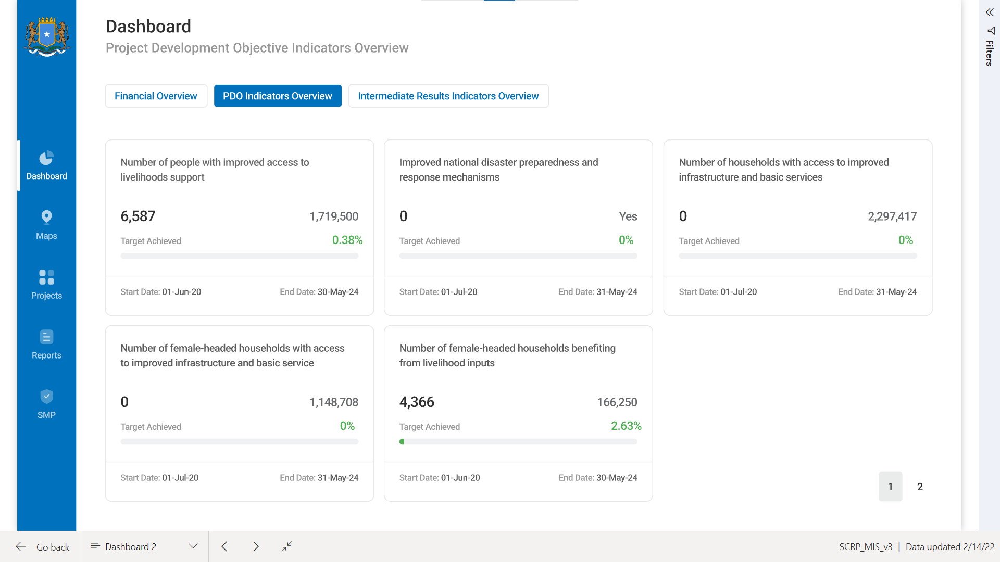

============
Introduction
============

The SCRP MIS uses **Microsoft Power BI** as its visualization platform and **KoBoToolbox** 
as its data collection platform. Together, they offer benefits such as:

- Fast and easy integration with external systems via API
- Real-time analytics of the SCRP progression
- Free and open-source data collection from KoBoToolbox
- Multi-platform data collection (Web Browser, Smartphones, Tablets etc.)

Visualization Platform
----------------------

Generally, the visualization platform is where we find dashboard reports regarding the progress of the SCRP project. 
It consists of the pages below:

+-----------+------------------------------------------------------------------------------------------------+
| Section   | Description                                                                                    |
+===========+================================================================================================+
| Dashboard | Contains a summary of high-level information regarding project performance and financial spend |
+-----------+------------------------------------------------------------------------------------------------+
| Maps      | Contains maps based on results collected from performance indicators                           |
+-----------+------------------------------------------------------------------------------------------------+
| Projects  | Contains records from various departments e.g. Procurement, Risks, etc.                        |
+-----------+------------------------------------------------------------------------------------------------+
| Reports   | Features graphs and visualizations based on records found in the projects section.             |
+-----------+------------------------------------------------------------------------------------------------+
| SMP       | Shows records and visualizations based on the Security Management Plan by HRM                  |
+-----------+------------------------------------------------------------------------------------------------+

**NB: You can access the dashboard using this** `link <https://app.powerbi.com/view?r=eyJrIjoiOTc2YWFmOTktNzM1OC00MzRhLWEwZTgtYzhjYjVkMjdmZjcwIiwidCI6ImYyYzcyMDg3LWIyNjAtNGUwNS1iOTVmLTI3NDVmOWM4MmYwNiJ9>`_.

Data Collection Platform
------------------------

.. image:: _static/kobotoolbox.png
  :width: 800
  :alt: KoBoToolbox

Generally, the visualization platform is where we find dashboard reports regarding the progress of the SCRP project. 
It consists of the pages below:

+------------------------------------------------------------------+---------------------------------------------------------------------------------------------+
| Tracking Tool                                                    | Description                                                                                 |
+==================================================================+=============================================================================================+
| `Performance Indicator <https://ee.kobotoolbox.org/x/kuICejSg>`_ | Tracks results achieved by implementing partners based on the Operational Results Framework |
+------------------------------------------------------------------+---------------------------------------------------------------------------------------------+
| `Risks & Issues <https://ee.kobotoolbox.org/x/xdYhX4Rw>`_        | Tracks Risks, Issues, and Lessons Learned within the SCRP.                                  |
+------------------------------------------------------------------+---------------------------------------------------------------------------------------------+
| `ES Safeguards <https://ee.kobotoolbox.org/x/x3tQOaMb>`_         | Tracks Stakeholder Engagements, Grievances, E&S Incidents etc. within the SCRP              |
+------------------------------------------------------------------+---------------------------------------------------------------------------------------------+
| `Procurement <https://ee.kobotoolbox.org/x/BaaUmkkN>`_           | Tracks procurement activities such as from Goods & Works and Consultants & Non Consultants. |
+------------------------------------------------------------------+---------------------------------------------------------------------------------------------+
| `Financial <https://ee.kobotoolbox.org/x/hmSg0rnd>`_             | Tracks financial expenditure per indicator/sub-component/component.                         |
+------------------------------------------------------------------+---------------------------------------------------------------------------------------------+
| `Contract <https://ee.kobotoolbox.org/x/37qlNHS7>`_              | Tracks contract details within the SCRP.                                                    |
+------------------------------------------------------------------+---------------------------------------------------------------------------------------------+
| `Asset Register <https://ee.kobotoolbox.org/x/aO3W62iq>`_        | Tracks asset reports within the SCRP on a monthly/quarterly basis.                          |
+------------------------------------------------------------------+---------------------------------------------------------------------------------------------+
| `Fiduciary Compliance <https://ee.kobotoolbox.org/x/zMdt8ob8>`_  | Tracks fiduciary compliance reports within the SCRP on a monthly/quarterly basis.           |
+------------------------------------------------------------------+---------------------------------------------------------------------------------------------+
| `Activity Work Plan <https://ee.kobotoolbox.org/x/NrJcgZ6U>`_    | Tracks IP activity/output work plans                                                        |
+------------------------------------------------------------------+---------------------------------------------------------------------------------------------+
| `SMP <https://ee.kobotoolbox.org/x/zbGNVvj9>`_                   | Tracks the project lifecycle and security incidents within the SCRP                         |
+------------------------------------------------------------------+---------------------------------------------------------------------------------------------+

**NB:** Click on the name of the tracking tool above to access it.