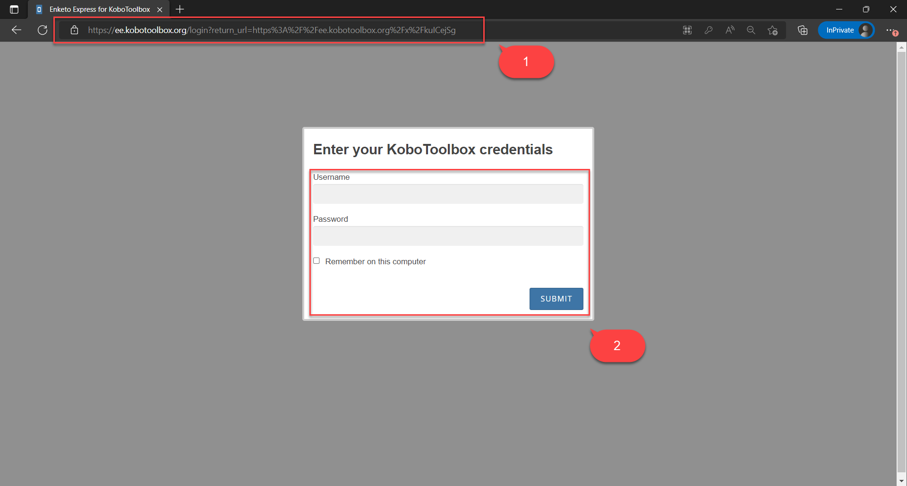
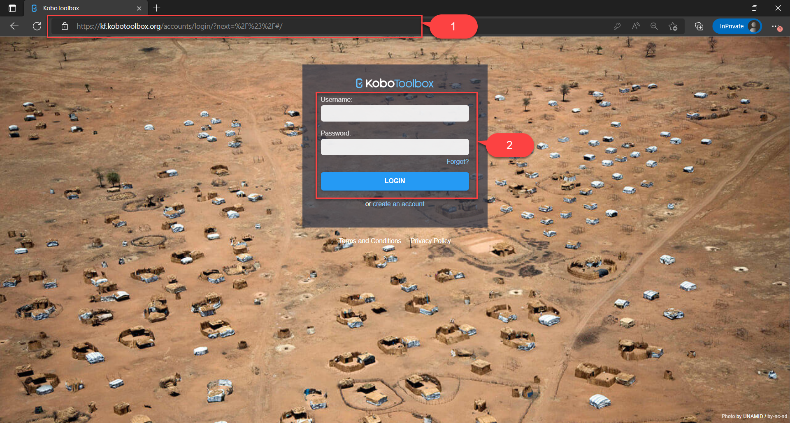
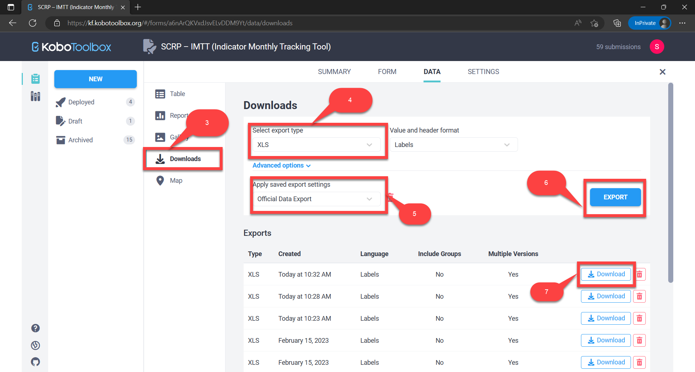

===========
Lessons Log
===========

Lessons Learned are experiences (positive or negative) distilled from past activities that can be 
taken into account for future actions and behaviors. Learning from Lessons is about reflecting on the experience 
to identify how things can be done differently in the future.

This guide shows IPs how to:

- Enter lesson logs
- Edit lesson logs
- Delete lesson logs
- Search, sort, and filter lesson logs
- Export lesson logs

Accessing The Lesson Log
------------------------

Use the link below to access the Lesson Log via KoBoToolbox:

- `https://ee.kobotoolbox.org/x/CnSmhhdK <https://ee.kobotoolbox.org/x/CnSmhhdK>`_

Below are the groups of users can access the Lesson Log. You can find detailed information about users here: 
:ref:`support:Users With Access to Data Collection Tools`

+-------------------+---------------+--------------+-----------------+-----------------+-----------------+
| User Group        | Can View Data | Can Add Data | Can Update Data | Can Delete Data | Can Export Data |
+===================+===============+==============+=================+=================+=================+
| MIS Administrator | Yes           | Yes          | Yes             | Yes             | Yes             |
+-------------------+---------------+--------------+-----------------+-----------------+-----------------+
| IPs               | Yes           | Yes          | Yes             | No              | Yes             |
+-------------------+---------------+--------------+-----------------+-----------------+-----------------+
| World Bank Group  | Yes           | Yes          | Yes             | No              | Yes             |
+-------------------+---------------+--------------+-----------------+-----------------+-----------------+

Submitting New Lesson Logs
---------------------------

IPs should first access the Lesson Log by:

#. Visiting the `KoBoToolbox Lesson Log URL <https://ee.kobotoolbox.org/x/CnSmhhdK>`_.
#. **Logging in** by entering the username and password shared by the PIU and hit submit button

IPs should then fill in the mandatory fields with details regarding the lesson log:

- LL#
- Date recorded on
- Recorded by
- Lessons category
- What happened
- What was the learning
- Suggested follow-on actions
- 

NB: Please note that it may take up to **24 hours** for the submitted data to appear on the dashboard.

Editing Lesson Log Records
----------------------------

IPs can edit their lesson logs on KoBoToolbox in case of any errors made during data entry. This can be done in four steps:

#. Access the **KoBoToolbox Portal**
#. **Locate the deployed SCRP Lesson Log** KoboToolbox form
#. **Locate the lesson log record** by ID and edit it
#. **Submit the edited record**

Access the KoBoToolbox Portal
^^^^^^^^^^^^^^^^^^^^^^^^^^^^^

#. Access the **KoBoToolbox Portal** via `this URL <https://kf.kobotoolbox.org/>`_ 
#. Login by entering the **username and password shared by the PIU** and hit **login button**

Locate the SCRP Lesson Log Form
^^^^^^^^^^^^^^^^^^^^^^^^^^^^^^^^^^^^^^^^^^^

#. Under **deployed projects**, click on the SCRP - Lesson log
#. Select the **Data tab** to view all records that had been previously submitted

Locate & edit the record
^^^^^^^^^^^^^^^^^^^^^^^^

#. **Locate the lesson log record** by the lesson log ID in the data table
#. Click on the **edit icon** to open a new tab and amend the record
#. Hit the **submit button** at the end of the form to save the edited record

Validating a record
^^^^^^^^^^^^^^^^^^^

#. **Locate the lesson log record** by the lesson log ID in the data table
#. **Select the record you want to validate** by clicking the checkbox against it
#. Click the **change status button** and select **"Set status: Approved"** to open a pop-up modal
#. Confirm validation by clicking the **"UPDATE VALIDATION STATUS" button** to validate the record

Deleting Lesson Log Records
---------------------------

#. :ref:`lessons-log:Access the KoBoToolbox Portal`
#. :ref:`lessons-log:Locate the SCRP Lesson Log Form`
#. **Locate the record** and select it by checking the checkbox
#. Click the **"Delete" button**
#. Confirm deletion and click the "**Delete Selected**" button to delete the record/s

Searching, Sorting, and Filtering Lesson Log Records
----------------------------------------------------

#. :ref:`lessons-log:Access the KoBoToolbox Portal`
#. :ref:`lessons-log:Locate the SCRP Lesson Log Form`
#. Search a column by typing your query in the **search fields**
#. Sort a column by clicking its title and selecting the **type of sorting**
#. Filter a column by selecting its **"Show All" drop-down button**

Exporting Lesson Log Records
----------------------------

#. :ref:`lessons-log:Access the KoBoToolbox Portal`
#. :ref:`lessons-log:Locate the SCRP Lesson Log Form`
#. Select the **"Downloads" tab**
#. Choose **export options** e.g. export type - **XLS, CSV, GeoJSON, SPSS, ZIP (Media Attachments)**
#. Ensure the default export settings **(Official Data Export)** is selected
#. Click the **"Export" button** to initiate the export (takes a few seconds)
#. Download the data by clicking the **"Download" button**