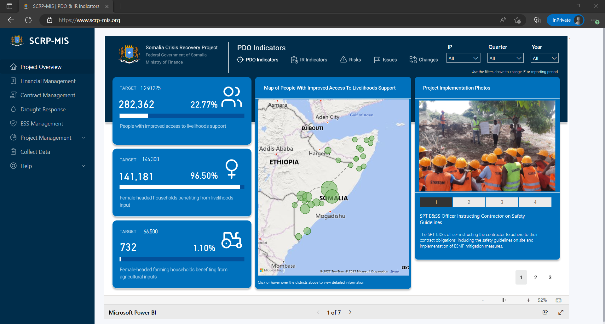
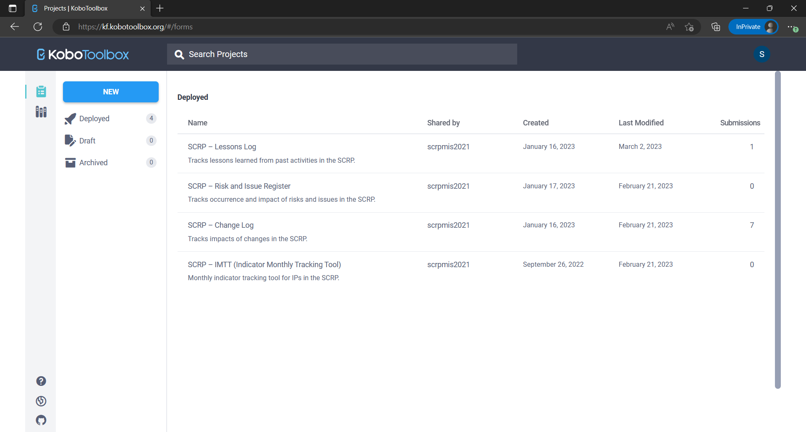

=================
SCRP-MIS Overview
=================

The SCRP MIS uses **Microsoft Power BI** as its visualization platform and **KoBoToolbox & Google Sheets** 
as its data collection platform. Together, they offer benefits such as:

- Fast and easy integration with external systems via API
- Real-time analytics of the SCRP progression
- Free and open-source data collection from KoBoToolbox
- Multi-platform data collection (Web Browser, Smartphones, Tablets etc.)

Visualization Platform
----------------------

Generally, the visualization platform is where we find dashboard reports regarding the progress of the SCRP project. 
It consists of the pages below:

+----------------------+----------------------------------------------------------------------------------------+
| Section              | Description                                                                            |
+======================+========================================================================================+
| Project Overview     | Contains a summary of PDO, Intermediate Result Indicators, and Risks/Issues highlights |
+----------------------+----------------------------------------------------------------------------------------+
| Financial Management | Contains a summary of the financial progress of the SCRP                               |
+----------------------+----------------------------------------------------------------------------------------+
| Contract Management  | Showcases and highlights key summary of contract and procurement activities            |
+----------------------+----------------------------------------------------------------------------------------+
| Drought Response     | Features drought response-related data that has been collected within the project      |
+----------------------+----------------------------------------------------------------------------------------+
| ESS Management       | Shows an overview of GRM within the SCRP                                               |
+----------------------+----------------------------------------------------------------------------------------+
| Project Management   | Features tabular records of risks, issues, lessons, and changes within the project     |
+----------------------+----------------------------------------------------------------------------------------+

**NB: You can access the dashboard using this** `link <https://www.scrp-mis.org>`_.

Data Collection Platform
------------------------

Generally, the visualization platform is where we find dashboard reports regarding the progress of the SCRP project. 
It consists of the pages below:

+---------------------------------+---------------------------------------------------------------------------------------------+
| Tracking Tool                   | Description                                                                                 |
+=================================+=============================================================================================+
| Indicator Monthly Tracking Tool | Tracks results achieved by implementing partners based on the Operational Results Framework |
+---------------------------------+---------------------------------------------------------------------------------------------+
| Risk & Issue Register           | Tracks Risks, Issues, and Lessons Learned within the SCRP.                                  |
+---------------------------------+---------------------------------------------------------------------------------------------+
| Lessons Log                     | Tracks lessons learned within the SCRP                                                      |
+---------------------------------+---------------------------------------------------------------------------------------------+
| Change Log                      | Tracks changes and change requests within the SCRP                                          |
+---------------------------------+---------------------------------------------------------------------------------------------+
| Financial Tracker               | Tracks financial expenditure per component within the SCRP.                                 |
+---------------------------------+---------------------------------------------------------------------------------------------+
| Contract & Procurement Tracker  | Tracks contract and procurement details within the SCRP.                                    |
+---------------------------------+---------------------------------------------------------------------------------------------+
| Drought Response Tracker        | Tracks drought related activities within the SCRP on a monthly/quarterly basis.             |
+---------------------------------+---------------------------------------------------------------------------------------------+
| GRM Tracker                     | Tracks GRM within the SCRP                                                                  |
+---------------------------------+---------------------------------------------------------------------------------------------+
