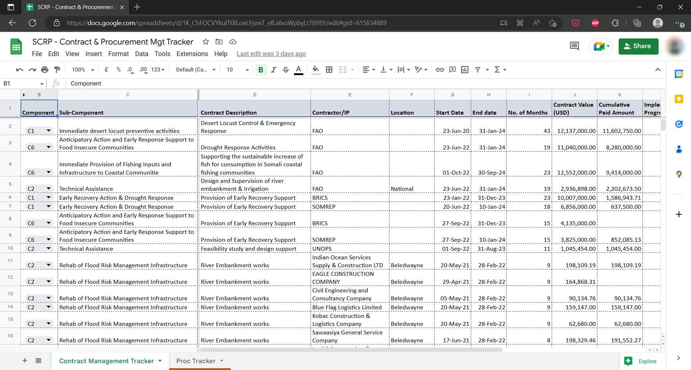
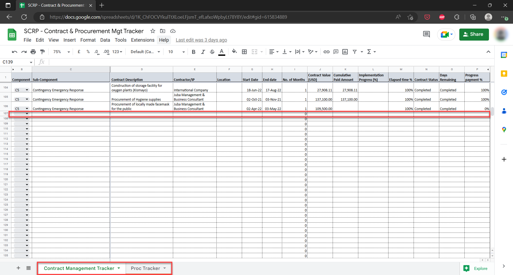

==============================
Contract & Procurement Tracker
==============================

The Contract and Procurement Management Tracker is a Google Sheets document 
containing both contract and procurement-related data within the SCRP.

This guide shows how the PIU can:

- Access the tracker
- Add, Edit, and Delete records
- Export the contract/procurement data

Accessing The Contract/Procurement Tracker
------------------------------------------

Use the link below to access the Financial Tracker:

- `https://docs.google.com/spreadsheets/d/1K_ChFOCVYkulTtXLoeLFjsmT_efLafxoWpbyLt78Y8Y/ <https://docs.google.com/spreadsheets/d/1K_ChFOCVYkulTtXLoeLFjsmT_efLafxoWpbyLt78Y8Y/>`_

Please note that **you need access rights from the PIU MIS Administrator** to view the tracker.

Adding, Editing, and Deleting Records
-------------------------------------

The Contract/Procurement Tracker has 2 work sheets that track different aspects:

- Contract Management Tracker
- Procurement Management Tracker

To get started on data entry/editing or deleting of records, do the following:

#. Select either of the two worksheets and enter data on the first empty row after the column headers
#. Edit data by selecting the specific cell you wish to Update
#. To delete data, you can either select a single cell or the entire row and hit the delete button

Exporting Contract/Procurement Data
-----------------------------------

.. image:: _static/gs_export.png
  :width: 800
  :alt: Accessing SCRP Contract/Procurement Data

#. Access the Contract/Procurement Tracker
#. Select "File" > "Download" from the navigation menu on Google Sheets
#. Choose the data format you want to begin download