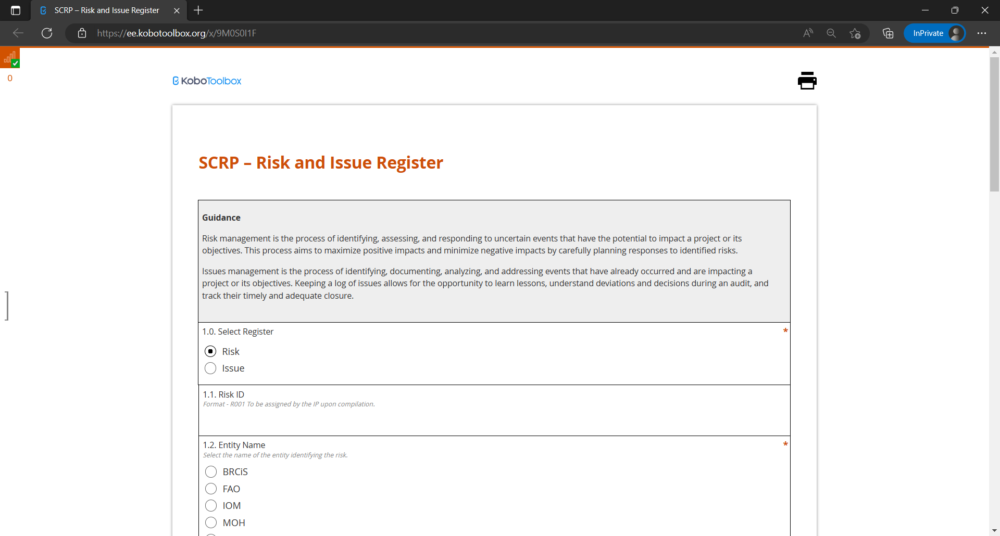
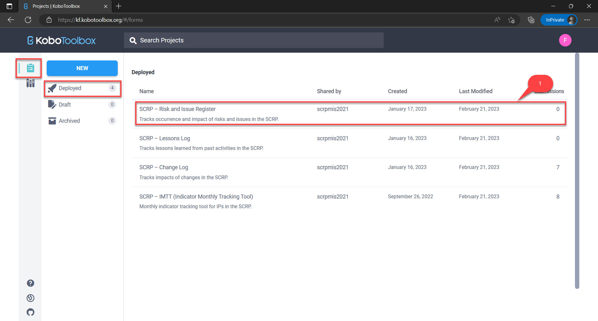
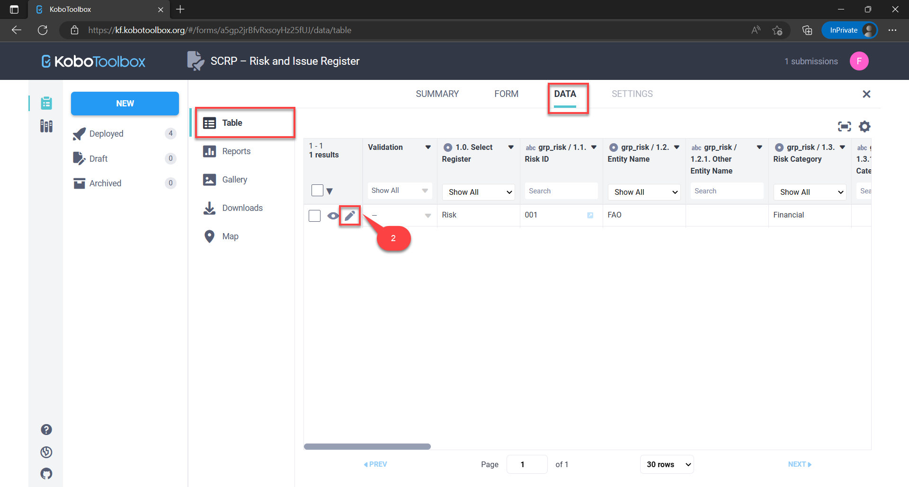
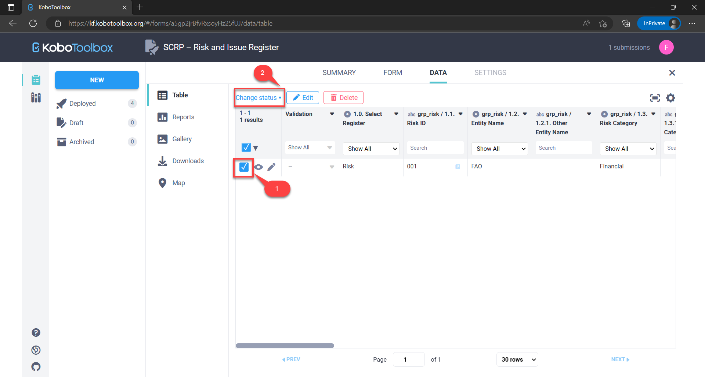
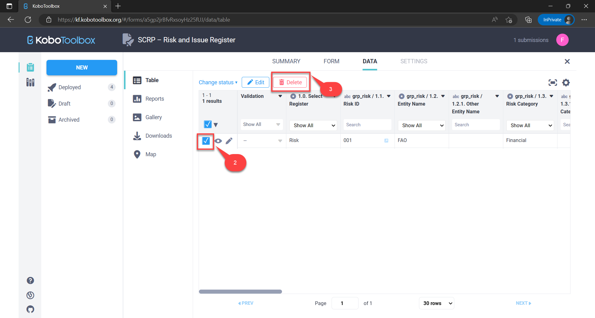
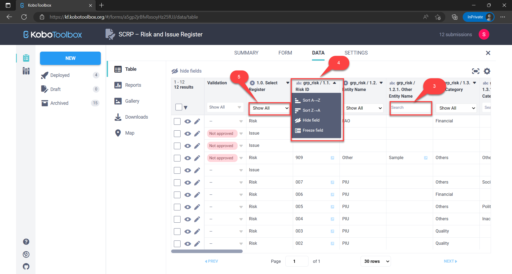

=====================
Risk & Issue Register
=====================

The SCRP Risk & Issue register helps in identifying, assessing, and responding to uncertain events 
that have the potential to impact the project or its objectives.

This guide shows IPs how to:

- Enter risk/issue logs
- Edit risk/issue logs
- Delete risk/issue logs
- Search, sort, and filter risk/issue logs
- Export risk/issue logs

Accessing The Risk & Issue Register
-----------------------------------

Use the link below to access the Risk & Issue Register via KoBoToolbox:

- `https://ee.kobotoolbox.org/x/9M0S0I1F <https://ee.kobotoolbox.org/x/9M0S0I1F>`_

Below are the groups of users can access the Risk & Issue register. You can find detailed information about users here: 
:ref:`support:Users With Access to Data Collection Tools`

+-------------------+---------------+--------------+-----------------+-----------------+-----------------+
| User Group        | Can View Data | Can Add Data | Can Update Data | Can Delete Data | Can Export Data |
+===================+===============+==============+=================+=================+=================+
| MIS Administrator | Yes           | Yes          | Yes             | Yes             | Yes             |
+-------------------+---------------+--------------+-----------------+-----------------+-----------------+
| IPs               | Yes           | Yes          | Yes             | No              | Yes             |
+-------------------+---------------+--------------+-----------------+-----------------+-----------------+
| World Bank Group  | Yes           | Yes          | Yes             | No              | Yes             |
+-------------------+---------------+--------------+-----------------+-----------------+-----------------+

Submitting New Risks/Issues
---------------------------
.. image:: _static/login.png
  :width: 800
  :alt: Accessing SCRP Risk & Issue Register

IPs should first access the Risk & Issue Register by:

#. Visiting the `KoBoToolbox Risk & Issue Register URL <https://ee.kobotoolbox.org/x/9M0S0I1F>`_.
#. **Logging in** by entering the username and password shared by the PIU and hit submit button

IPs should then fill in the mandatory fields with details regarding the risk/issue:

- Type of register
- Risk ID
- Entity name
- Risk category
- Risk title
- Risk description
- Risk probability
- Risk impact
- Risk proximity
- Risk impact description
- Risk response measures
- Responsibility
- Risk status
- Date updated

NB: Please note that it may take up to **24 hours** for the submitted data to appear on the dashboard.

Editing Risks/Issues Records
----------------------------

IPs can edit their risk/issue logs on KoBoToolbox in case of any errors made during data entry. This can be done in four steps:

#. Access the **KoBoToolbox Portal**
#. **Locate the deployed SCRP-Risk and Issue Register** KoboToolbox form
#. **Locate the risk/issue record** by reporting date and edit it
#. **Submit the edited record**

Access the KoBoToolbox Portal
^^^^^^^^^^^^^^^^^^^^^^^^^^^^^
.. image:: _static/kobo_login.png
  :width: 800
  :alt: KoBoToolbox login page

#. Access the **KoBoToolbox Portal** via `this URL <https://kf.kobotoolbox.org/>`_ 
#. Login by entering the **username and password shared by the PIU** and hit **login button**

Locate the SCRP Risk & Issue Register Form
^^^^^^^^^^^^^^^^^^^^^^^^^^^^^^^^^^^^^^^^^^^

#. Under **deployed projects**, click on the SCRP-Risk and Issue Register
#. Select the **Data tab** to view all records that had been previously submitted

Locate & edit the record
^^^^^^^^^^^^^^^^^^^^^^^^

#. **Locate the risk/issue record** by the risk/issue ID in the data table
#. Click on the **edit icon** to open a new tab and amend the record
#. Hit the **submit button** at the end of the form to save the edited record

Validating a record
^^^^^^^^^^^^^^^^^^^

#. **Locate the risk/issue record** by the risk/issue ID in the data table
#. **Select the record you want to validate** by clicking the checkbox against it
#. Click the **change status button** and select **"Set status: Approved"** to open a pop-up modal
#. Confirm validation by clicking the **"UPDATE VALIDATION STATUS" button** to validate the record

Deleting Risk/Issue Records
---------------------------

#. :ref:`risk-issue-register:Access the KoBoToolbox Portal`
#. :ref:`risk-issue-register:Locate the SCRP Risk & Issue Register Form`
#. **Locate the record** and select it by checking the checkbox
#. Click the **"Delete" button**
#. Confirm deletion and click the "**Delete Selected**" button to delete the record/s

Searching, Sorting, and Filtering Risk/Issue Records
----------------------------------------------------

#. :ref:`risk-issue-register:Access the KoBoToolbox Portal`
#. :ref:`risk-issue-register:Locate the SCRP Risk & Issue Register Form`
#. Search a column by typing your query in the **search fields**
#. Sort a column by clicking its title and selecting the **type of sorting**
#. Filter a column by selecting its **"Show All" drop-down button**

Exporting Risk/Issue Records
----------------------------
.. image:: _static/kobo_export.png
  :width: 800
  :alt: KoBoToolbox records export

#. :ref:`risk-issue-register:Access the KoBoToolbox Portal`
#. :ref:`risk-issue-register:Locate the SCRP Risk & Issue Register Form`
#. Select the **"Downloads" tab**
#. Choose **export options** e.g. export type - **XLS, CSV, GeoJSON, SPSS, ZIP (Media Attachments)**
#. Ensure the default export settings **(Official Data Export)** is selected
#. Click the **"Export" button** to initiate the export (takes a few seconds)
#. Download the data by clicking the **"Download" button**