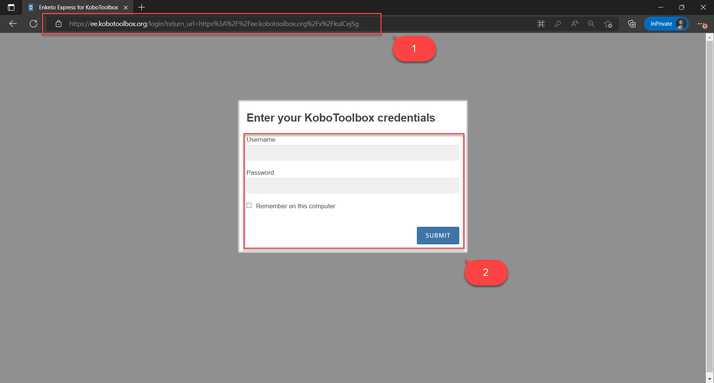
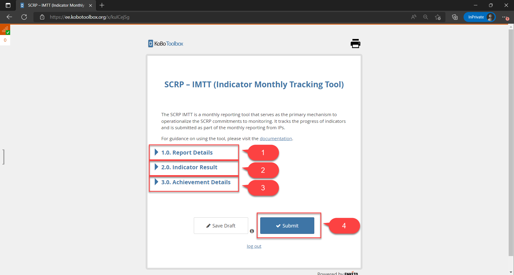
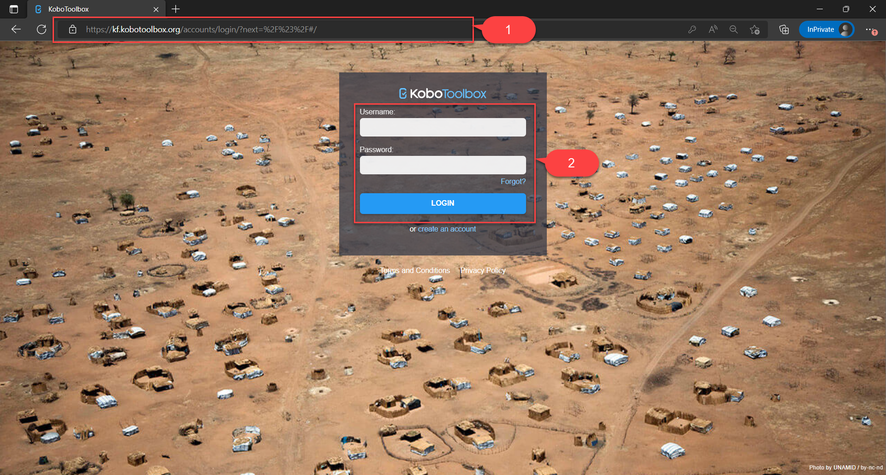
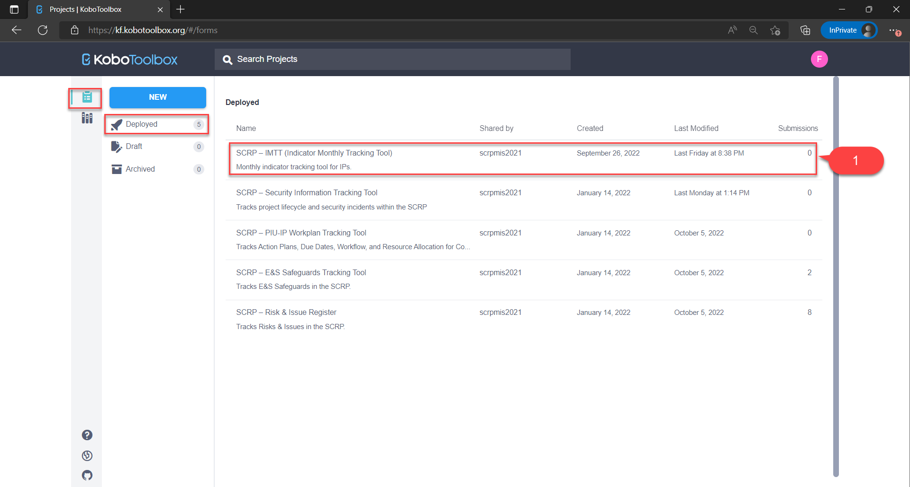
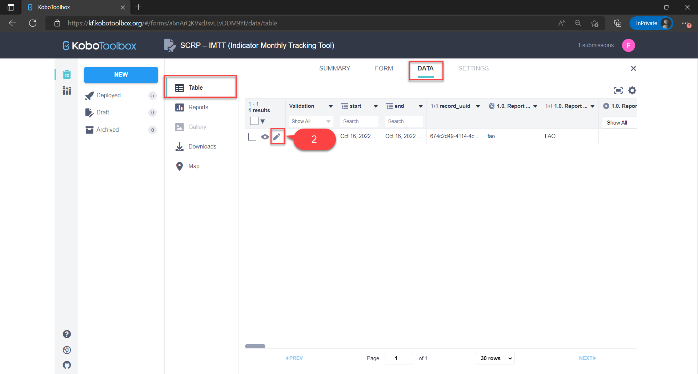
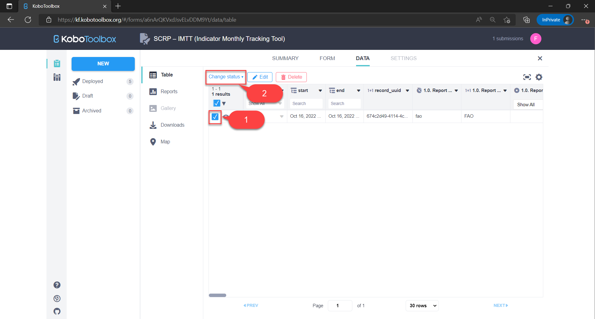
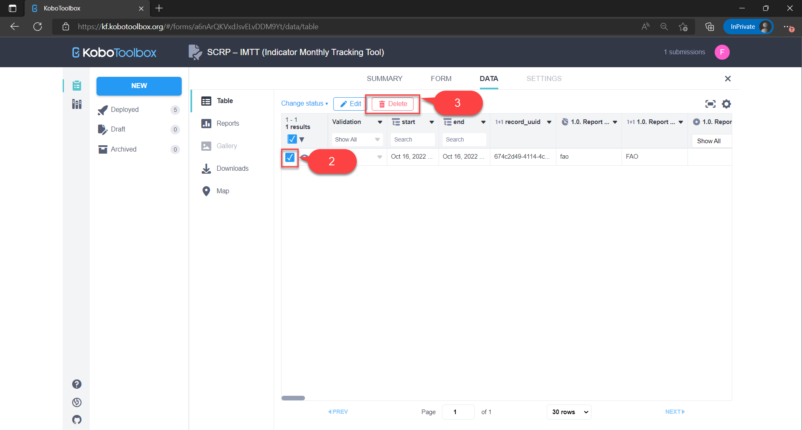
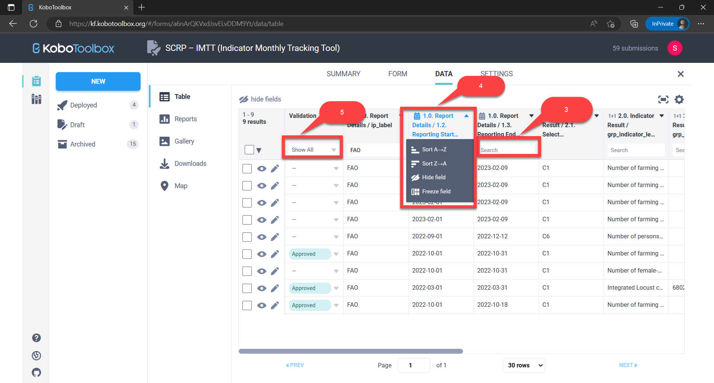
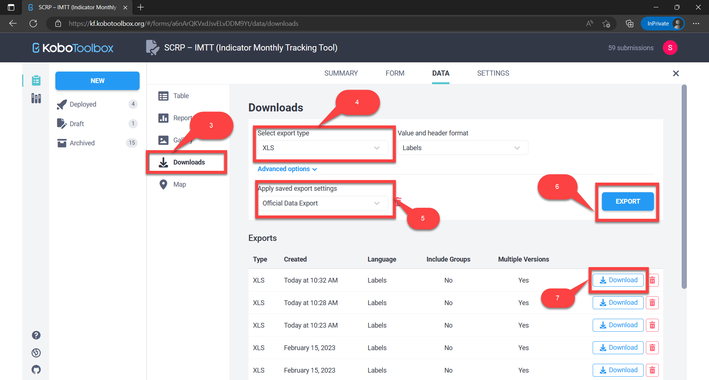

=====================
Risk & Issue Register
=====================

The SCRP IMTT is a monthly reporting tool that serves as the primary mechanism to operationalize the SCRP commitments to monitoring. 
It tracks the progress of indicators and is submitted as part of the monthly reporting from IPs.

..  youtube:: ERT1H3oJUn4
  :width: 700
  :height: 400

This guide shows IPs how to:

- Enter indicator results
- Edit indicator results
- Delete indicator results
- Search, sort, and filter indicator results
- Export indicator results

Accessing The Risk & Issue Register
-----------------------------------

Use the link below to access the IMTT via KoBoToolbox:

- `https://ee.kobotoolbox.org/x/kuICejSg <https://ee.kobotoolbox.org/x/kuICejSg>`_

Below are the groups of users can access the IMTT. You can find detailed information about users here: 
:ref:`support:Users With Access to Data Collection Tools`

+-------------------+---------------+--------------+-----------------+-----------------+-----------------+
| User Group        | Can View Data | Can Add Data | Can Update Data | Can Delete Data | Can Export Data |
+===================+===============+==============+=================+=================+=================+
| MIS Administrator | Yes           | Yes          | Yes             | Yes             | Yes             |
+-------------------+---------------+--------------+-----------------+-----------------+-----------------+
| IPs               | Yes           | Yes          | Yes             | No              | Yes             |
+-------------------+---------------+--------------+-----------------+-----------------+-----------------+
| World Bank Group  | Yes           | No           | No              | No              | Yes             |
+-------------------+---------------+--------------+-----------------+-----------------+-----------------+

Submitting New Risks/Issues
---------------------------

IPs should first access the IMTT by:

#. Visiting the `KoBoToolbox IMTT URL <https://ee.kobotoolbox.org/x/kuICejSg>`_.
#. **Logging in** by entering the username and password shared by the PIU and hit submit button

IPs can then submit their monthly reporting through the IMTT in four steps:

- Fill in the report details
- Fill in the indicator result
- Fill in achievement results if available
- Submit the indicator result

NB: Please note that it may take up to **24 hours** for the submitted data to appear on the dashboard.

Editing Risks/Issues Records
----------------------------

IPs can edit their indicator results on KoBoToolbox in case of any errors made during data entry. This can be done in four steps:

#. Access the **KoBoToolbox Portal**
#. **Locate the deployed SCRP-IMTT** KoboToolbox form
#. **Locate the indicator record** by reporting date and edit it
#. **Submit the edited record**

Access the KoBoToolbox Portal
^^^^^^^^^^^^^^^^^^^^^^^^^^^^^

#. Access the **KoBoToolbox Portal** via `this URL <https://kf.kobotoolbox.org/>`_ 
#. Login by entering the **username and password shared by the PIU** and hit **login button**

Locate the SCRP Risk & Issuer Register Form
^^^^^^^^^^^^^^^^^^^^^^^^^^^^^^^^^^^^^^^^^^^

#. Under **deployed projects**, click on the SCRP-IMTT (Indicator Monthly Tracking Tool)
#. Select the **Data tab** to view all records that had been previously submitted

Locate & edit the record
^^^^^^^^^^^^^^^^^^^^^^^^

#. **Locate the indicator record** by the reporting start/end date in the data table
#. Click on the **edit icon** to open a new tab and amend the record
#. Hit the **submit button** at the end of the form to save the edited record

Validating a record
^^^^^^^^^^^^^^^^^^^

#. **Locate the indicator record** by the reporting start/end date in the data table
#. **Select the record you want to validate** by clicking the checkbox against it
#. Click the **change status button** and select **"Set status: Approved"** to open a pop-up modal
#. Confirm validation by clicking the **"UPDATE VALIDATION STATUS" button** to validate the record

Deleting Risk/Issue Records
---------------------------

#. :ref:`indicator-tracking-tool:Access the KoBoToolbox Portal`
#. :ref:`indicator-tracking-tool:Locate the SCRP-IMTT Form`
#. **Locate the record** and select it by checking the checkbox
#. Click the **"Delete" button**
#. Confirm deletion and click the "**Delete Selected**" button to delete the record/s

Searching, Sorting, and Filtering Risk/Issue Records
----------------------------------------------------

#. :ref:`indicator-tracking-tool:Access the KoBoToolbox Portal`
#. :ref:`indicator-tracking-tool:Locate the SCRP-IMTT Form`
#. Search a column by typing your query in the **search fields**
#. Sort a column by clicking its title and selecting the **type of sorting**
#. Filter a column by selecting its **"Show All" drop-down button**

Exporting Risk/Issue Records
----------------------------

#. :ref:`indicator-tracking-tool:Access the KoBoToolbox Portal`
#. :ref:`indicator-tracking-tool:Locate the SCRP-IMTT Form`
#. Select the **"Downloads" tab**
#. Choose **export options** e.g. export type - **XLS, CSV, GeoJSON, SPSS, ZIP (Media Attachments)**
#. Ensure the default export settings **(Official Data Export)** is selected
#. Click the **"Export" button** to initiate the export (takes a few seconds)
#. Download the data by clicking the **"Download" button**